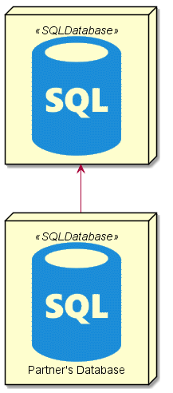

# Azure-PlantUML
PlantUML sprites, macros, stereotypes, and other goodies for creating [PlantUML](http://plantuml.com) diagrams with Azure components.

> **Inspired by:** <https://github.com/milo-minderbinder/AWS-PlantUML>

Azure-PlantUML has high-quality sprites and convenient macros for Azure components and services for many of the Azure icons in the [Cloud and Enterprise Symbol/Icon Set](https://www.microsoft.com/en-us/download/details.aspx?id=41937) package, so that you can quickly and easily add stylized Azure elements to your [PlantUML](http://plantuml.com) deployment diagrams.

## Getting Started
At the top of your PlantUML `.puml` file, first include the the `common.puml` file found in the `dist` folder at the root of this repo. You can link directly to the file in this repo with:

```
!includeurl https://raw.githubusercontent.com/seesharprun/AZURE-PlantUML/master/dist/common.puml
```

After the `common.puml` is added, you can then add any additional `.puml` files from Azure-PlantUML to import the specific sprites, macros, and other definitions you need. Sometimes it's helpful to define a constant pointing to the `dist` folder of the Azure PlantUML version you're using, to make switching versions and hosts easier.

```
!define AZPUML https://raw.githubusercontent.com/seesharprun/AZURE-PlantUML/master/dist/

!includeurl AZPUML/common.puml
!includeurl AZPUML/SQLDatabase/SQLDatabase.puml
```

Macro definitions for components, like SQL Databases, will take an alias as the first parameter, and a label as an optional second parameter:

```
SQLDATABASE(local_account)
SQLDATABASE(partner_account, "Partner's Database")

local_account <-- partner_account
```


